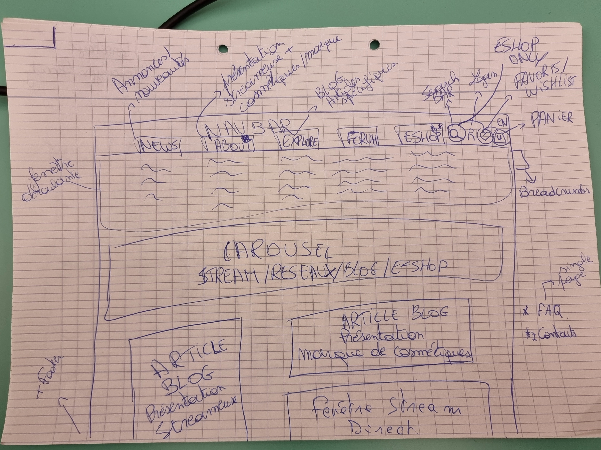

# Apocalypse Beauty

**Moutain Group Project.**

<!-- Link of the finished project : [here](https://becodeorg.github.io/hamilton-7-escapium-DaDaQue-1/). -->

## **What's the project ?**

A girl who do streaming created her own make-up and skincare brand. She asks us to create a website to combine her streaming community for her make-up and skincare brand.

16 January - 20 January(3-4 Days) :
To do so, we need to create a website with a stream first. So a homepage static like and then incorporate Vue.Js to make it dynamic. For the backend, we need to create a login/register system.

23 January - 24 January (2 days) :
If the homepage is done,the front will do the "About" page.

25 January - 26 January (2 days) :
Streaming features on the home page go next.

30 January- 17 February (3 weeks) :
Once the streaming features, the homepage and the about are done entirely, we can start to work on the e-Shop.
E-Shop features (search-bar, wishlist and basket).

Bonuses: English and French pages, blog with database, add edit and delete articles.

## **Who did this project ?**

Team members : [Olivia](https://github.com/OliviaDemaret), [Christophe](https://github.com/Crimsm), [Romain](https://github.com/Zaddes),[David](https://github.com/DAbranka).

## **Who took what part ?**

- Olivia : Frontend.
- Christophe: Frontend.
- Romain : Backend.
- David : Fullstack.

## **Some Design Sketches**

## **What language are used?**

HTML, SCSS, Javascript, Vue.Js, Laravel.

<!-- ## **What the easiest part ?**

- David : The Footer.
- Quentin : The navbar was pretty difficult to achieve.
- Danaé : the HTML and SCSS of each page, and the organization of all the SCSS folders. -->

<!-- ## **What the hardest part ?**

- David : Integrate the Google map and also the area icon on it.
- Quentin : Make the html of each pages.
- Danaé : the Javascript's animations. -->
